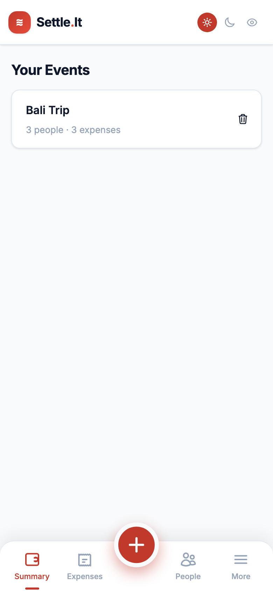
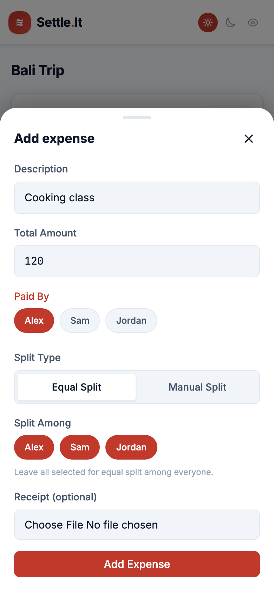
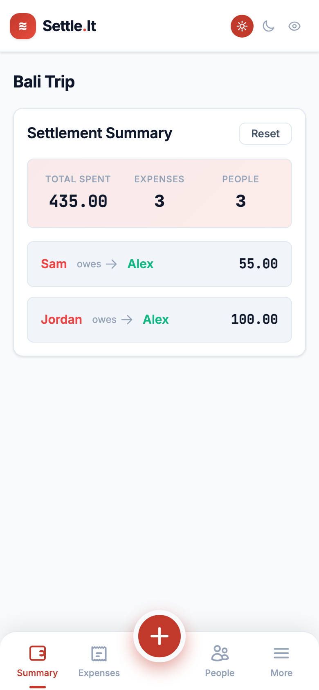

# Settleit

[](LICENSE)
[](https://nextjs.org/)
[](https://react.dev/)
[](https://web.dev/progressive-web-apps/)

A privacy-first, offline-capable expense splitter built with Next.js. Track
who paid for what across shared events — trips, dinners, household bills —
and get back the **minimum set of settlement transactions** needed to clear
everyone's debts ("Alex owes Sam $12").

Everything runs in the browser: there is **no account, no server, and no
telemetry**. Your data lives in `localStorage` on your device, and the app
works offline as an installable PWA.

**▶ [Live demo](https://phdwight.github.io/settleit/)** — open on a phone and
"Add to Home Screen" to install it.

## Contents

- [Screenshots](#screenshots)
- [Features](#features)
- [Use cases](#use-cases)
- [How it works](#how-it-works)
- [Tech stack](#tech-stack)
- [Getting started](#getting-started)
- [Scripts](#scripts)
- [Project structure](#project-structure)
- [Confirmations for destructive actions](#confirmations-for-destructive-actions)
- [Internationalization](#internationalization)
- [Testing](#testing)
- [Data & privacy](#data--privacy)
- [Deployment](#deployment)
- [Known limitations & roadmap](#known-limitations--roadmap)
- [Contributing](#contributing)
- [License](#license)

## Screenshots

| Events | Add expense | Debt summary |
| --- | --- | --- |
|  |  |  |

## Features

- **Multiple events** — keep trips, dinners, and household bills separate,
  each with its own participants and expenses.
- **Multi-payer expenses** — a single expense can be split across several
  payers, each contributing their own amount.
- **Flexible splitting** — divide an expense equally or enter manual
  per-person amounts.
- **Debt simplification** — nets everyone's balances and emits the smallest
  practical number of payback transactions instead of a web of IOUs.
- **Receipt attachments** — attach an optional (downscaled) receipt image to
  any expense; it travels with the exported data.
- **Export / import** — back up or share an event as a self-contained JSON
  file, then import it on another device.
- **Offline-first PWA** — a service worker caches the app shell so it loads
  and runs without a network connection; installable to the home screen.
- **Light / dark / system theme** and a mobile-first, accessible UI.
- **Safe destructive actions** — deleting an event or removing a participant
  shows exactly what will be lost before you confirm.

## Use cases

- **Group trips** — hotels, flights, and meals paid by different people;
  settle up at the end.
- **Shared dinners / nights out** — one person covers the bill, split it fairly.
- **Households / roommates** — recurring groceries, utilities, and rent shares.
- **Events** — parties or gifts where several people chip in.

Anywhere a group needs to answer "who owes whom, and how little money has to
change hands to settle it?"

## How it works

1. **Create an event** and add its **participants**.
2. **Log expenses**, choosing who paid (one or more payers) and how the cost
   is split (equal or manual).
3. The app computes each person's **net balance** (paid − owed) and runs a
   greedy **debt simplifier** to produce a short list of settlement
   transactions.
4. All state is persisted to `localStorage` on every change and rehydrated on
   load; export to JSON any time for backup or sharing.

The debt simplifier is deterministic and fast — not the (NP-hard) globally
optimal minimum, but typically optimal for real group sizes.

## Tech stack

- **[Next.js 16](https://nextjs.org/)** (App Router) — built as a fully static
  export (`output: 'export'`), so it can be hosted on any static host.
- **[React 19](https://react.dev/)** with TypeScript.
- **[Tailwind CSS v4](https://tailwindcss.com/)** for styling.
- **State**: a single `useReducer` + React Context store (no external state
  library); split logic uses a Strategy pattern and debts are recomputed
  live.
- **Persistence**: browser `localStorage` (with automatic migration of legacy
  data shapes).
- **PWA**: a hand-written service worker (`public/sw.js`) plus a web manifest.
- **Testing**: [Jest](https://jestjs.io/) + ts-jest with `jsdom` and
  [Testing Library](https://testing-library.com/) for components.
- **Tooling**: ESLint (flat config) and TypeScript 5.
- **Hosting**: deployed to GitHub Pages via GitHub Actions.

## Getting started


```bash
npm install
npm run dev
```

Open [http://localhost:3000](http://localhost:3000).

### Running on a different port

The dev server defaults to port `3000`. To use another port, pass the flag
through to `next dev` (the `--` forwards it) or set the `PORT` env var:

```bash
npm run dev -- -p 4000      # one-off, then open http://localhost:4000
PORT=4000 npm run dev       # same, via environment variable
```

To make it permanent, edit the `dev` script in
[package.json](package.json) to `"next dev -p 4000"`. `npm start` (the
production server) accepts the same `-p` / `PORT` options.

### Previewing the production build

`npm run dev` does not run the service worker or the static export the way
production does. To exercise the real PWA/offline behavior locally:

```bash
npm run build   # static export to ./out (output: 'export')
npm start       # serve the production build
```

The `/settleit` base path is only applied under GitHub Actions, so a local
build still serves from `/` at `http://localhost:3000`.

## Scripts

| Command                 | Purpose                       |
| ----------------------- | ----------------------------- |
| `npm run dev`           | Start the Next.js dev server  |
| `npm run build`         | Production build (static export to `./out`) |
| `npm start`             | Run the production build      |
| `npm run lint`          | Lint with ESLint              |
| `npm test`              | Run the Jest test suite       |
| `npx jest --coverage`   | Run the tests with a coverage report |

## Project structure

```
src/
  app/              Next.js app router entry points and global styles
  components/       Presentational + interactive UI
  contexts/         React context providers (AppContext, ThemeContext)
  hooks/            Custom hooks
  lib/              Domain logic, services, and shared utilities
    messages.tsx    Centralized user-facing strings (i18n-ready)
    strategies/     Split-calculation strategies
test/               Jest tests mirroring the src/ layout
```

## Confirmations for destructive actions

Deleting an **event** or removing a **participant** opens a `ConfirmDialog`
that explains exactly what will be lost (expense counts, receipts, debts).
The dialog is accessible (`role="dialog"`, `aria-modal`, focus management,
Escape to cancel, click-outside to dismiss).

## Internationalization

All confirmation-flow strings live in
[src/lib/messages.tsx](src/lib/messages.tsx), grouped by feature
(`confirmDialog`, `events`, `participants`). Values that need variables
(names, counts) are exposed as functions, and a `plural()` helper handles
English plural forms.

To swap in a real i18n library later, replace the `messages` export with a
hook (e.g. `useMessages()`) that returns the same shape sourced from the
active locale. Component call sites won't need to change.

## Testing

Tests live under `test/` and use Jest + ts-jest with `jsdom`. Component
tests use `@testing-library/react`.

```bash
npm test                 # run everything once
npx jest --watch         # re-run affected tests on change
npx jest AppProvider     # run a single suite by name
npx jest --coverage      # full run with a coverage report
```

Coverage covers the reducer and the `AppProvider` hooks, split
strategies, debt simplification, storage/export services, the messages
module, ID generation, and the `ConfirmDialog` component (statements and
lines are both above 95%).

## Data & privacy

Settleit stores everything **locally in your browser** — there is no backend,
no account, and no analytics. Concretely:

- App state (events, participants, expenses, receipts) lives under the
  `settleit_state` key in `localStorage`; theme and per-event panel state use
  their own keys.
- Receipt images are downscaled and embedded as base64 in the exported data,
  so an exported event is fully self-contained.
- **Back up or move data** with **More → Export this event** (JSON), and
  restore it with **Import event** on any device.
- **Clear everything** with **More → Clear all data**, which also drops the
  cache and unregisters the service worker.

Because data is device-local, it is **not synced across devices or browsers** —
use export/import to move it.

## Deployment

The app is a fully static export (`output: 'export'`), so it can be served
from any static host. This repo ships to **GitHub Pages** via GitHub Actions:

- Pushing to `main` runs
  [.github/workflows/deploy.yml](.github/workflows/deploy.yml), which builds,
  exports to `./out`, and publishes to Pages.
- Under GitHub Actions the build sets `basePath` / `assetPrefix` to
  `/settleit` (see [next.config.ts](next.config.ts)); local builds serve
  from `/`.

To deploy elsewhere, run `npm run build` and serve the generated `out/`
directory as static files.

## Known limitations & roadmap

- **No cross-device sync.** Data is local to one browser; use export/import to
  move it.
- **`localStorage` limits.** Events with many receipt images can approach
  browser storage quotas; saves fail silently if the quota is exceeded.
- **Debt simplification is greedy**, not the (NP-hard) globally minimal set —
  deterministic and usually optimal for realistic group sizes.
- **English only** for now, though all copy is centralized and i18n-ready.
- **Split modes**: equal and manual today; percentage / shares / by-item are
  natural future strategies.

## Contributing

Issues and pull requests are welcome. Before opening a PR:

- Run `npm test` and `npm run lint` — both must pass.
- Follow the conventions in [handoff.md](handoff.md) (layering rules, one
  source of truth for state, and routing every user-facing string through
  [src/lib/messages.tsx](src/lib/messages.tsx)).
- Add or update tests for any non-trivial logic.

## License

Licensed under the **Apache License 2.0**. See [LICENSE](LICENSE) for details.

## Data & privacy

Settleit stores everything **locally in your browser** — there is no backend,
no account, and no analytics. Concretely:

- App state (events, participants, expenses, receipts) lives under the
  `settleit_state` key in `localStorage`; theme and per-event panel state use
  their own keys.
- Receipt images are downscaled and embedded as base64 in the exported data,
  so an exported event is fully self-contained.
- **Back up or move data** with **More → Export this event** (JSON), and
  restore it with **Import event** on any device.
- **Clear everything** with **More → Clear all data**, which also drops the
  cache and unregisters the service worker.

Because data is device-local, it is **not synced across devices or browsers** —
use export/import to move it.

## Deployment

The app is a fully static export (`output: 'export'`), so it can be served
from any static host. This repo ships to **GitHub Pages** via GitHub Actions:

- Pushing to `main` runs
  [.github/workflows/deploy.yml](.github/workflows/deploy.yml), which builds,
  exports to `./out`, and publishes to Pages.
- Under GitHub Actions the build sets `basePath` / `assetPrefix` to
  `/settleit` (see [next.config.ts](next.config.ts)); local builds serve
  from `/`.

To deploy elsewhere, run `npm run build` and serve the generated `out/`
directory as static files.

## Known limitations & roadmap

- **No cross-device sync.** Data is local to one browser; use export/import to
  move it.
- **`localStorage` limits.** Events with many receipt images can approach
  browser storage quotas; saves fail silently if the quota is exceeded.
- **Debt simplification is greedy**, not the (NP-hard) globally minimal set —
  deterministic and usually optimal for realistic group sizes.
- **English only** for now, though all copy is centralized and i18n-ready.
- **Split modes**: equal and manual today; percentage / shares / by-item are
  natural future strategies.

## Contributing

Issues and pull requests are welcome. Before opening a PR:

- Run `npm test` and `npm run lint` — both must pass.
- Follow the conventions in [handoff.md](handoff.md) (layering rules, one
  source of truth for state, and routing every user-facing string through
  [src/lib/messages.tsx](src/lib/messages.tsx)).
- Add or update tests for any non-trivial logic.

## License

Licensed under the **Apache License 2.0**. See [LICENSE](LICENSE) for details.
